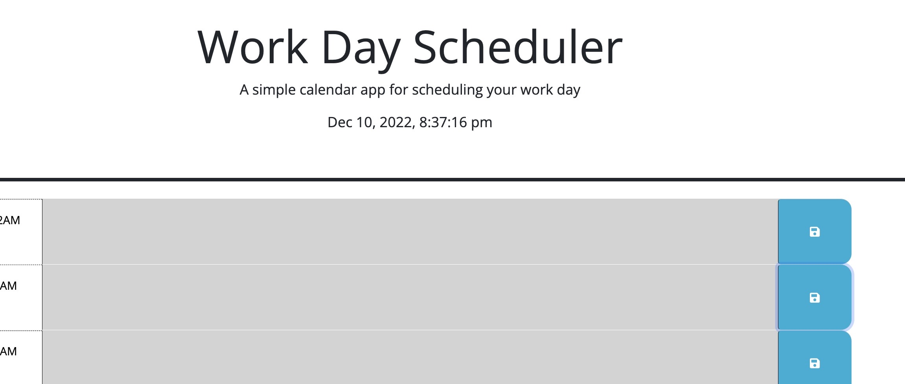
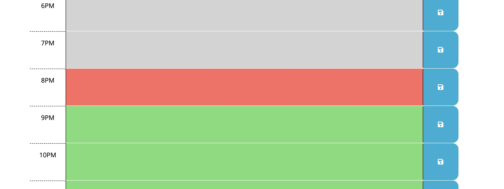
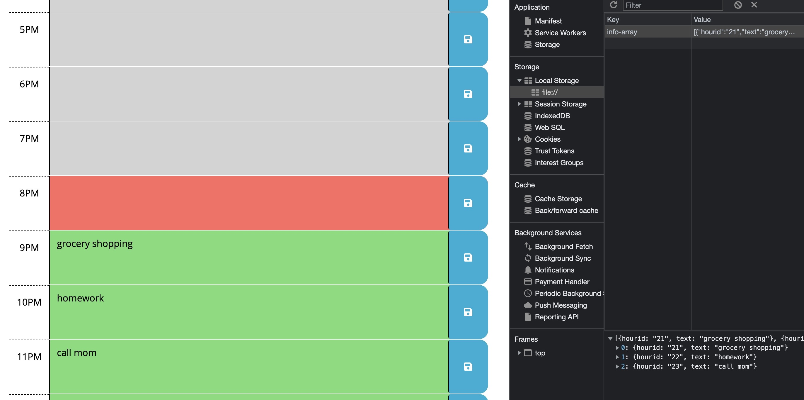
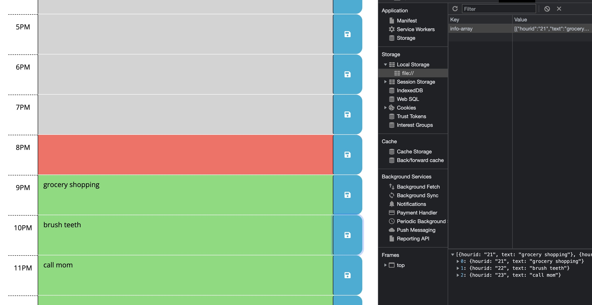

# Challenge 03: Random Password Generator - Due Dec 5, 2022

## Introduction

The purpose of this challenge was to familiarize me with jquery and bootstrap, and continue to practice using JavaScript effectively.

## Techniques Used

I employed the use of a multitude of document methods via jquery, including query selectors, create elements, append elements, and others, and employed a number of JavaScript methods, including timer intervals, local storage, and others.

## Examples of Use

Upon load, users are presented with a header that includes the date and time along with 24 time slots, one for each hour. Any previously saved schedule items would load with the page:

The current hour is highlighted in red, with past hours grey, and future hours green:

Each time the user saves an event, they're stored locally in an array:

If the user needs to replace a schedule item or delete a scheduled item, it gets replaced in the locally stored array:

Any previously stored schedule items are displayed on page load.

## Link to Deployed Application

<a href="https://harryhamlin.github.io/schedulingapp/">https://harryhamlin.github.io/schedulingapp/</a>